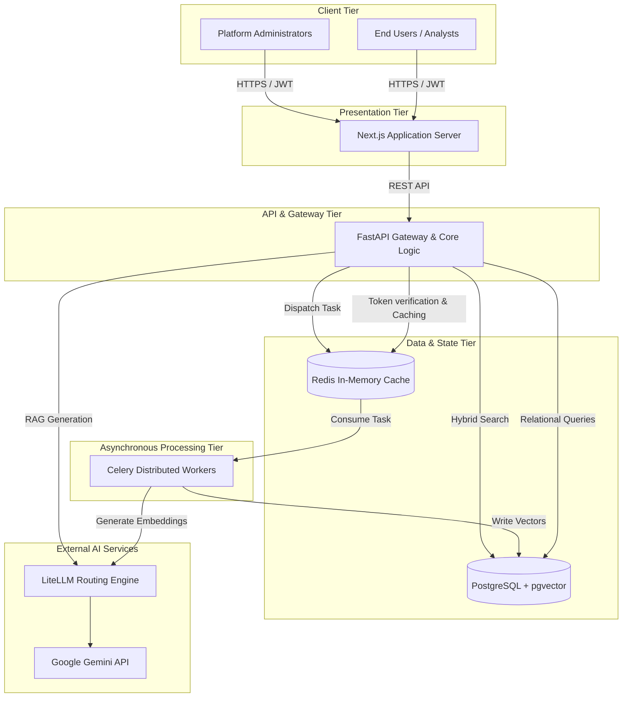
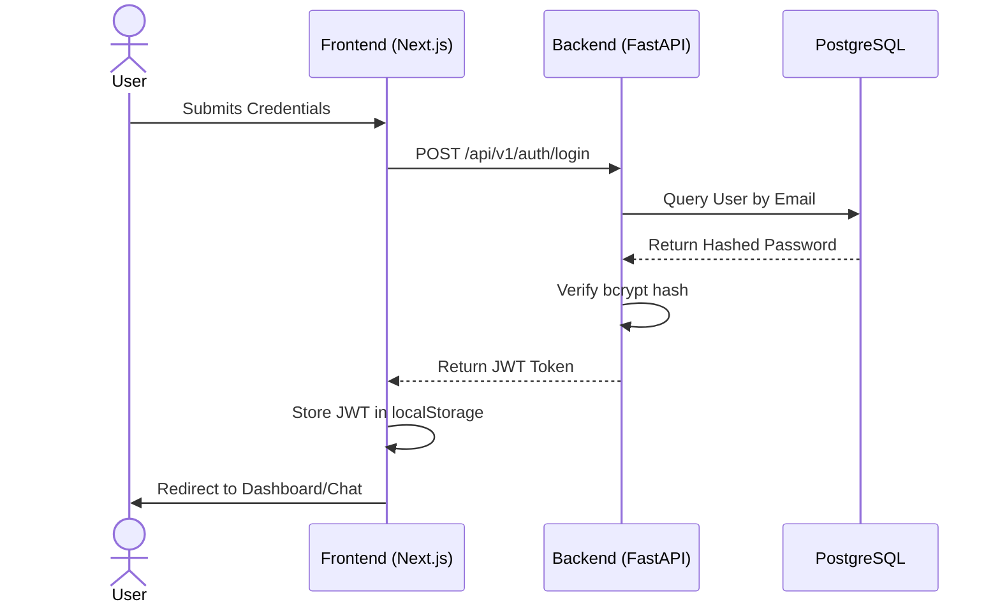
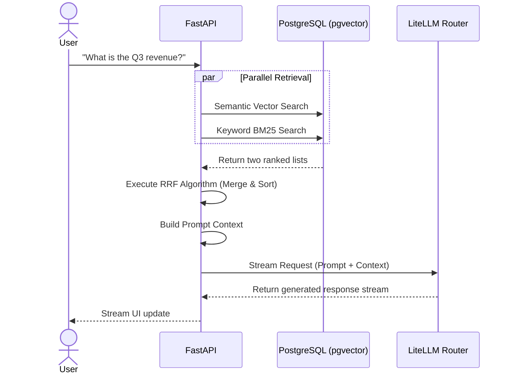
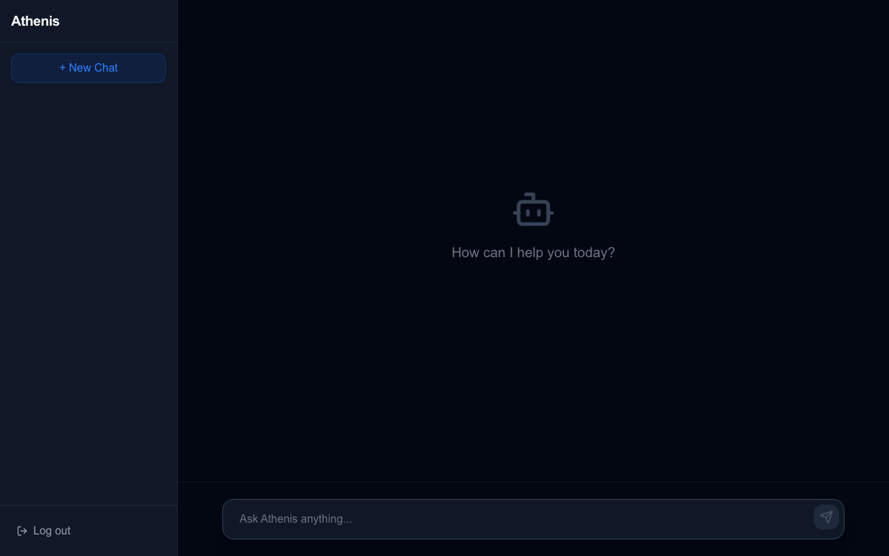
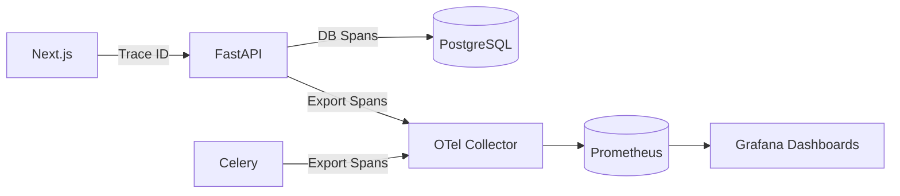
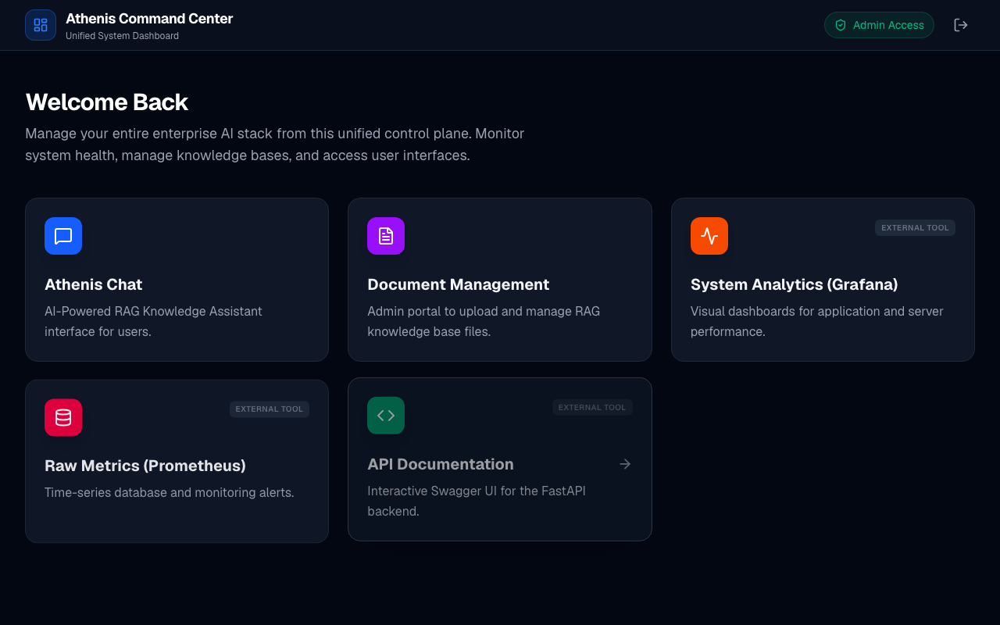

# 1. Introduction & Strategic Vision

## 1.1 Purpose of this Handbook
Welcome to the Athenis AI Platform. If you are reading this, you are likely a new senior engineer, architect, or DevOps specialist joining the team. This handbook is your definitive guide to understanding the platform. It is not a code reference manual; rather, it is a comprehensive journey through the architectural decisions, data flows, failure states, and runtime behaviors that define Athenis. By the time you finish this book, you will possess a complete mental model of the entire system and be capable of modifying, scaling, and debugging it with absolute confidence.

## 1.2 The Business Problem & Motivation
In modern enterprise environments, organizations possess vast amounts of unstructured data (PDFs, internal wikis, documentation) but struggle to extract actionable insights securely. Public LLMs (like OpenAI's ChatGPT) pose severe data privacy risks, and building custom models is prohibitively expensive.

**Athenis** was engineered to solve this exact problem by implementing a self-hosted, multi-tenant **Retrieval-Augmented Generation (RAG)** architecture. Instead of retraining models, Athenis dynamically fetches secure, proprietary context from a high-performance vector database and injects it into the prompt. Furthermore, to avoid vendor lock-in, the platform utilizes an abstraction layer that routes requests to any major LLM provider (Gemini, Claude, GPT-4) based on availability and cost.

## 1.3 Engineering Tradeoffs & Core Decisions
To achieve enterprise scalability, several critical architectural choices were made:

| Technology | The Problem it Solves | Why it was Chosen over Alternatives |
|------------|-----------------------|-------------------------------------|
| **FastAPI** | Backend API serving | Chosen for native `asyncio` support and extreme throughput compared to Django/Flask. |
| **Next.js** | Frontend presentation | Chosen for Server-Side Rendering (SSR) and seamless SEO optimization. |
| **PostgreSQL** | Data persistence | Selected because the `pgvector` extension allows us to store relational data and vector embeddings in the exact same ACID-compliant database. |
| **Redis** | State management | Chosen for its sub-millisecond latency. It acts as both a caching layer and the Celery message broker. |
| **Celery** | Asynchronous jobs | Essential for offloading heavy PDF parsing and embedding extraction so the main API event loop is never blocked. |
| **LiteLLM** | AI Routing | Chosen to prevent vendor lock-in. It standardizes API calls across 100+ LLMs. |

* * *

# 2. The 10,000-Foot View: Enterprise Topology

## 2.1 Architectural Overview
Athenis operates as a decoupled, microservices-inspired platform. The architecture is intentionally separated into a synchronous, user-facing presentation layer and an asynchronous, heavy-compute processing layer.

## 2.2 System Diagram



## 2.3 The Request Lifecycle (High Level)
When a user submits a query to the chat interface:
1. The **Next.js** frontend captures the input and attaches the user's JWT.
2. The request hits **FastAPI**, which validates the JWT via **Redis** to ensure the token hasn't been revoked and the user hasn't exceeded rate limits.
3. FastAPI executes a **Hybrid Search** against **PostgreSQL**, combining semantic vector similarity with exact keyword matching.
4. The retrieved context is bundled with the original prompt.
5. FastAPI forwards the payload to **LiteLLM**, which dynamically routes it to the designated provider (e.g., Gemini).
6. The generated response is streamed back through FastAPI to the Next.js frontend, rendering in real-time for the user.

## 2.4 Important Notes & Best Practices
- **Network Isolation:** In production, only the Next.js server is exposed to the public internet via an Ingress controller. FastAPI, PostgreSQL, and Redis remain completely isolated within the private VPC.
- **Stateless APIs:** The FastAPI layer is entirely stateless. Any instance can be killed or spun up instantly because all state is offloaded to Redis and PostgreSQL.

## 2.5 Troubleshooting the Core Topology
**Symptom:** The frontend loads, but all API requests instantly fail with HTTP 502 Bad Gateway.
**Root Cause Diagnosis:** The Nginx reverse proxy (or Kubernetes Ingress) cannot reach the FastAPI service. 
**Verification:** SSH into the cluster and run `curl http://backend:8000/health`. If it times out, the backend container has crashed or the Docker bridge network is misconfigured.

* * *
# 3. The User Journey: Authentication & Access Control

## 3.1 Introduction to the Authentication Flow
When a user opens Athenis in their browser, they are greeted by a unified login portal. Before any data can be queried or uploaded, the user must prove their identity. The authentication architecture relies entirely on stateless **JSON Web Tokens (JWT)**. 

Why stateless? By issuing a cryptographically signed token that lives in the client’s browser (`localStorage`), the FastAPI backend does not need to store thousands of active session IDs in a database. This decision dramatically reduces database I/O and allows the backend to scale horizontally without sticky sessions.

## 3.2 The Login Sequence
1. The user inputs their email and password on the Next.js login screen.
2. Next.js wraps this into an `OAuth2PasswordRequestForm` payload and dispatches a `POST` request to `/api/v1/auth/login`.
3. The FastAPI router intercepts this request. It immediately queries the PostgreSQL `users` table to fetch the hashed password.
4. Using the `bcrypt` algorithm, FastAPI verifies the password. If it matches, the `AuthService` generates a JWT containing the user's `sub` (username) and their `role` (Admin vs User).
5. The JWT is returned to Next.js, which stores it securely and redirects the user.



## 3.3 Role-Based Access Control (RBAC) Enforcement
Athenis defines two rigid roles:
- **Users**: Bound exclusively to the `/chat` interface. They can query the cognitive engine but cannot upload documents or view system metrics.
- **Administrators**: Granted elevated privileges. They bypass the chat and are redirected to the Unified Dashboard (`/dashboard`) where they manage the Knowledge Base.

### 3.3.1 How Roles are Enforced Internally
When an Administrator attempts to navigate to the Document Management page, Next.js does not simply trust the local state. Instead, it fires a secondary validation request to `/api/v1/auth/me`. 

The FastAPI backend decodes the JWT using the `SECRET_KEY`. If the signature is valid, it inspects the embedded role. If a normal user attempts to force their way into the admin panel, FastAPI immediately rejects the request with a `403 Forbidden` HTTP status, and Next.js forces a hard redirect back to the login screen.

## 3.4 Visualizing the Interface


*Figure 3.1: The Athenis Login Portal. This screen exists to securely funnel users and administrators into their respective isolated environments.*

## 3.5 Common Mistakes & Troubleshooting
- **Mistake**: Changing the `SECRET_KEY` in the `.env` file after users have already logged in. 
  - *Result*: All currently issued JWTs will immediately become invalid. Users will see a `401 Unauthorized` error when they try to send a message. 
  - *Solution*: Always force users to log out and log back in if the signing key is rotated.
- **Troubleshooting Role Bounces**: If an Admin is repeatedly bounced back to the User chat, verify that the `is_admin` boolean flag in the PostgreSQL `users` table is set to `true`. This often occurs during manual database migrations if the flag defaults to `false`.

* * *
# 4. The Ingestion Pipeline: Turning Documents into Knowledge

## 4.1 Introduction & Purpose
For an LLM to answer questions about proprietary data, it first needs access to that data in a machine-readable, mathematically searchable format. This process is called "Ingestion." Athenis implements a highly robust, asynchronous pipeline to process PDFs and text documents uploaded by Administrators.

## 4.2 Architectural Tradeoffs
Why not process documents directly in the FastAPI endpoint?
If an Admin uploads a 500-page PDF, processing it (parsing text, splitting it, calling an embedding model thousands of times) might take 5 minutes. If FastAPI handled this synchronously, the HTTP request would block the worker thread, causing the connection to time out and rendering the API unresponsive to other users.

To solve this, Athenis uses **Celery**. Celery acts as an asynchronous task queue. The FastAPI endpoint simply saves the file to disk and says "I'm done." It then throws a message into a Redis queue. A separate Celery worker process constantly monitors Redis, picks up the task, and does the heavy lifting in the background.

## 4.3 The Step-by-Step Execution Lifecycle
1. **Upload Request**: An Administrator navigates to the Document Management dashboard and uploads a file.
2. **Streaming to Disk**: FastAPI receives the file and streams it directly to a secure volume to avoid exhausting RAM.
3. **Database Registration**: A record is inserted into the `documents` table with a status of `PROCESSING`.
4. **Message Broker Hand-off**: FastAPI enqueues a `process_document_task` into Redis.
5. **Text Extraction**: The Celery worker picks up the task, opens the file, and extracts raw text.
6. **Chunking**: The raw text is split into smaller overlapping "chunks" (e.g., 1000 characters with a 200-character overlap). This ensures that sentences are not broken abruptly and context is preserved.
7. **Embedding Generation**: The worker sends these chunks to the LLM Embedding API (e.g., `text-embedding-3-small`). The API returns a 768-dimensional vector representation of the text.
8. **Vector Storage**: The chunks and their corresponding vectors are saved into the `document_chunks` PostgreSQL table utilizing the `pgvector` extension.
9. **Completion**: The document status is updated to `READY`.

```mermaid
flowchart TD
    A[Admin] -->|Upload File| API[FastAPI /upload]
    API -->|1. Save File| Disk[(Local Volume)]
    API -->|2. Insert 'PROCESSING'| DB[(PostgreSQL)]
    API -->|3. Enqueue Task| Redis[(Redis Broker)]
    API -->> A: Returns 202 Accepted
    
    Redis -->|4. Consume Task| Worker[Celery Worker]
    Worker -->|5. Read File| Disk
    Worker -->|6. Chunk Text| Worker
    Worker -->|7. Generate Embeddings| EmbedAPI[Embedding Model]
    Worker -->|8. Store Vectors & BM25| DB
    Worker -->|9. Update to 'READY'| DB
```

## 4.4 Data Flow & PostgreSQL pgvector Integration
Once the data reaches PostgreSQL, it is stored in the `document_chunks` table. This table contains:
- `text`: The raw string of the chunk.
- `embedding`: A mathematical array of floats (`VECTOR(768)`).
- `fts_vector`: A parsed TSVECTOR representation used for Full-Text Search (keyword matching).

By maintaining all three formats in a single row, Athenis avoids the architectural complexity of running two separate databases (e.g., Pinecone + PostgreSQL). This drastically reduces infrastructure costs and prevents data synchronization nightmares.

## 4.5 Visualizing the Interface


*Figure 4.1: The Knowledge Base Dashboard. This screen allows Administrators to upload documents and track the real-time processing status of the asynchronous Celery pipeline.*

## 4.6 Troubleshooting the Ingestion Pipeline
- **Symptom:** Documents remain stuck in the `PROCESSING` state indefinitely.
  - *Root Cause:* The Celery worker process is either dead or disconnected from Redis.
  - *Diagnosis:* Run `docker compose -f docker-compose.prod.yml logs -f celery_worker`. If you see "Cannot connect to Redis," verify the network configuration. If the logs are completely empty, the container has likely crashed or run out of memory.
- **Symptom:** Out Of Memory (OOM) Killed.
  - *Root Cause:* Processing excessively large PDFs (1GB+) without chunking the byte stream.
  - *Solution:* Ensure the Docker container is allocated at least 4GB of RAM, and verify the `CHUNK_SIZE` parameter in `document_tasks.py` is respected.

* * *
# 5. The Cognitive Engine: Hybrid RAG & Reciprocal Rank Fusion

## 5.1 Introduction & Purpose
Once documents are ingested and stored, the platform must retrieve them accurately when a user asks a question. Standard vector search (Cosine Similarity) is excellent at understanding the *meaning* of a sentence, but it often fails catastrophically at retrieving exact names, SKUs, or specialized terminology.

To solve this, Athenis implements a highly sophisticated **Hybrid Search Algorithm**.

## 5.2 The Retrieval Architecture (RRF)
When a user submits a query via the Chat Interface, the `RetrievalService` executes two parallel searches against PostgreSQL:

1. **Dense Vector Search**: The user's query is sent to the embedding model, converted into a vector, and compared against the `document_chunks` table using pgvector's `<=>` (cosine distance) operator.
2. **Sparse Keyword Search**: Simultaneously, the raw text query is converted into a `tsquery` and matched against the `fts_vector` column using PostgreSQL's native Full-Text Search (BM25).

If Athenis simply appended these two lists of results together, the AI would be overwhelmed by duplicate or irrelevant context. Instead, it uses **Reciprocal Rank Fusion (RRF)**.

### 5.2.1 How Reciprocal Rank Fusion Works
RRF is a mathematical technique to combine the rankings of multiple search strategies. For every chunk returned by either search, a score is calculated using the formula:
`RRF Score = 1.0 / (k + rank)`

By merging the lists based on this RRF score, Athenis guarantees that if a chunk is highly relevant in *both* semantic meaning and exact keyword matches, it rises to the absolute top of the context window.

## 5.3 The Generation Flow (LiteLLM Integration)
Once the top `N` highly-relevant chunks are retrieved, they are injected into the Prompt Template as `context`. 

Why `litellm`? Enterprise platforms cannot afford vendor lock-in. If OpenAI experiences an outage, or if Gemini releases a drastically cheaper model, engineering teams need to switch providers instantly. `litellm` abstracts the API differences between all major providers. 

The FastAPI backend passes the enriched prompt to `litellm`, which routes the request to the configured backend (currently Gemini).



## 5.4 Visualizing the Interface


*Figure 5.1: The Athenis Chat Interface. As the user types, the backend silently executes the RRF algorithm, pulling proprietary context from PostgreSQL before streaming the response back to the UI.*

## 5.5 Common Mistakes & Troubleshooting
- **Mistake**: Lowering the `k` constant in the RRF formula below 60.
  - *Result*: The fusion heavily penalizes items that only appear in one list, causing critical keyword matches (like serial numbers) to drop out of the context window entirely.
- **Troubleshooting Missing Answers**: If the AI responds "I don't know," check the retrieval threshold. If the vectors are too dissimilar, they might be dropped before hitting the LLM.

* * *

# 6. Infrastructure, Telemetry, and Deployment

## 6.1 Introduction & Purpose
A modern AI application is only as good as its deployment pipeline. Athenis uses a multi-stage Docker build process and a comprehensive OpenTelemetry observability stack to guarantee enterprise-grade uptime and visibility.

## 6.2 The Observability Stack
In an asynchronous, decoupled architecture, tracing a request is difficult. If a user asks a question, the request hits Next.js, then FastAPI, then the Embedding model, then PostgreSQL, then LiteLLM.

Athenis implements **OpenTelemetry (OTel)** to inject Trace IDs into every HTTP header and database span.
- **Prometheus**: Scrapes numerical metrics (e.g., API latency, error rates, LLM token consumption).
- **Grafana**: Visualizes these metrics in unified dashboards, allowing administrators to monitor costs and latency.



## 6.3 Deployment Architecture (Docker & K8s)
Athenis avoids monolithic deployments. 
- The **Frontend** uses Next.js `standalone` output mode to produce an ultra-lean Alpine Linux Docker image containing only runtime dependencies.
- The **Backend** utilizes Gunicorn alongside Uvicorn to spawn multiple asynchronous worker processes, maximizing CPU utilization on multi-core servers.

When deploying to Kubernetes, the system utilizes Horizontal Pod Autoscalers (HPA). The Celery workers can scale independently based on the size of the Redis message queue. If an administrator uploads 10,000 PDFs, the cluster will automatically spin up 50 Celery pods to churn through the backlog, then spin them down to save costs.

## 6.4 Visualizing Telemetry


*Figure 6.1: The System Dashboard. This is a crucial tool for administrators to track API Latency, Token Usage, and Active User counts in real-time, pulling directly from the underlying telemetry metrics.*

## 6.5 Best Practices for Production
- **Secrets Management**: Never commit `GEMINI_API_KEY` or `POSTGRES_PASSWORD`. Always use a secrets manager (like AWS Secrets Manager or HashiCorp Vault) and inject them as environment variables at runtime.
- **Scaling Redis**: Redis must be highly available. In production, utilize Redis Sentinel or a managed service like AWS ElastiCache. If Redis drops, the entire asynchronous ingestion pipeline instantly halts.

# 7. Summary & Conclusion
By breaking the system into a reactive presentation layer (Next.js), a stateless gateway (FastAPI), a stateful compute layer (Celery), and a unified data store (PostgreSQL + pgvector), Athenis achieves an extremely resilient architecture. You now possess the foundational knowledge of how data flows, how AI is routed, and how failures are mitigated. You are fully prepared to contribute, debug, and scale the Athenis platform.
