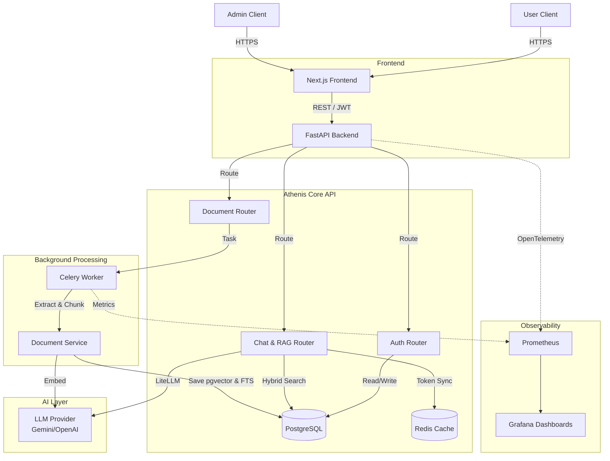
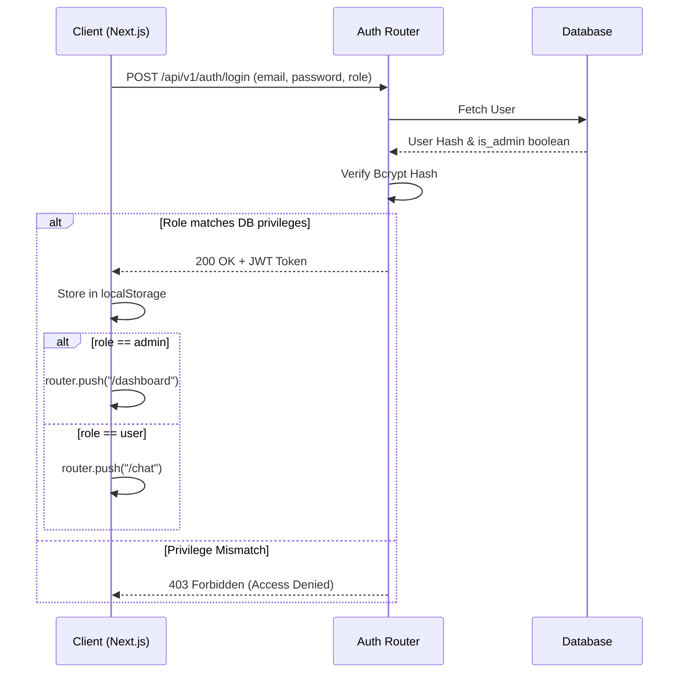
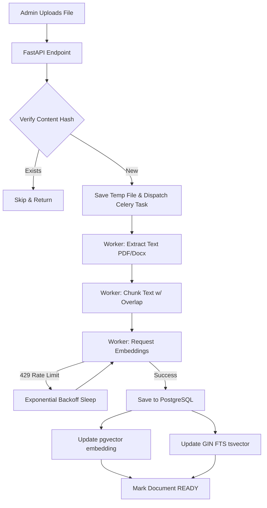
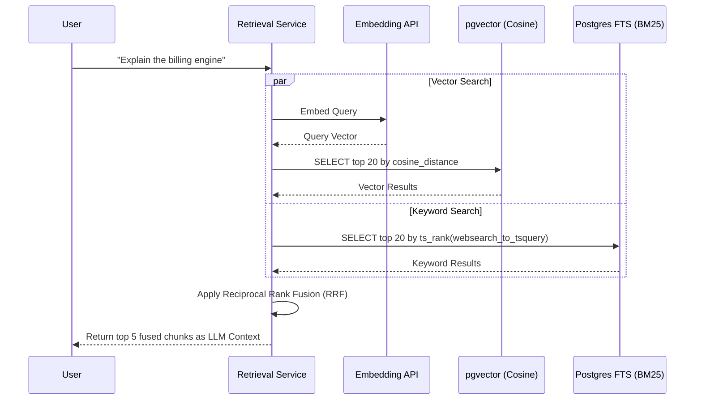
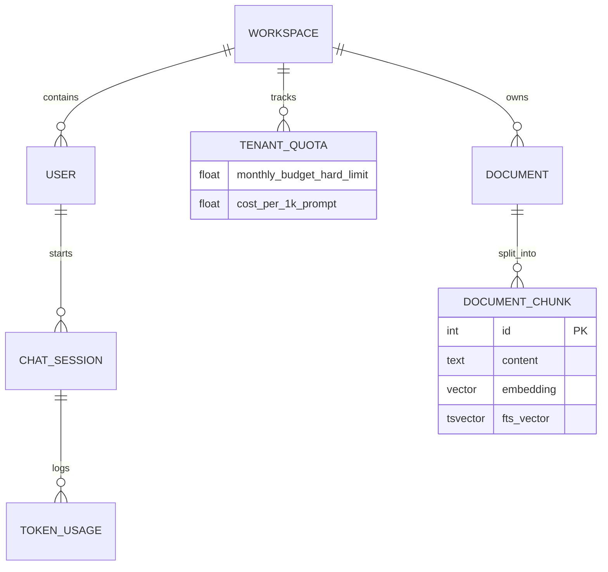

<div align="center">
  
  <h1>Athenis AI Platform</h1>
  <p><strong>Enterprise-Grade, Cloud-Native Hybrid RAG Engine with Multi-Tenant Architecture</strong></p>

  [](https://www.python.org)
  [](https://fastapi.tiangolo.com)
  [](https://nextjs.org)
  [](https://www.postgresql.org)
  [](https://redis.io)
  [](https://www.docker.com)
  [](https://kubernetes.io)
  [](LICENSE)
</div>

<br />

## 📖 Table of Contents

- [Overview & Motivation](#-overview--motivation)
- [Key Features](#-key-features)
- [System Architecture](#-system-architecture)
- [Core Technologies](#-core-technologies)
- [Detailed Workflows](#-detailed-workflows)
  - [Authentication & RBAC](#1-authentication--rbac-flow)
  - [Async Document Ingestion](#2-async-document-ingestion-pipeline)
  - [Hybrid Search (RAG)](#3-hybrid-search--retrieval-rag-flow)
  - [AI Provider Abstraction](#4-ai-provider-abstraction)
  - [Multi-Tenant Billing](#5-multi-tenant-billing--token-tracking)
- [Database Schema](#-database-schema)
- [Observability & Monitoring](#-observability--monitoring)
- [Benchmarks & Performance](#-benchmarks--performance)
- [Repository Structure](#-repository-structure)
- [API Reference](#-api-reference)
- [Deployment](#-deployment)

---

## 🎯 Overview & Motivation

**Athenis** is a highly scalable, enterprise-grade Retrieval-Augmented Generation (RAG) platform. It solves the critical enterprise challenges of secure document processing, robust access control, multi-tenant cost tracking, and AI provider lock-in.

By implementing **Hybrid Search (Vector + Full-Text Search)** merged via **Reciprocal Rank Fusion (RRF)**, Athenis achieves world-class retrieval accuracy. The platform abstracts the underlying LLM via `litellm`, allowing seamless switching between Google Gemini, OpenAI, Anthropic, or local Ollama instances without code changes.

---

## ✨ Key Features

- **Hybrid Search RAG Engine:** Combines `pgvector` cosine similarity with PostgreSQL `tsvector` Full-Text Search (BM25) using Reciprocal Rank Fusion.
- **Provider-Agnostic LLM Layer:** Powered by `litellm` to route requests dynamically across any foundation model.
- **Async Document Processing:** Celery-based workers extract, chunk, embed, and index large documents in the background with intelligent rate-limit backoffs.
- **Role-Based Access Control (RBAC):** Strict segregation between `User` (Agent Access) and `Admin` (Dashboard/Document Management) roles at the JWT and API level.
- **Multi-Tenant Billing:** Tracks exact prompt/completion token usage per session/workspace and calculates hard/soft budget limits.
- **Full Observability Stack:** OpenTelemetry instrumentation feeding traces and metrics to Prometheus and Grafana.
- **Cloud-Native Deployment:** Containerized with multi-stage Dockerfiles and Kubernetes manifests for instant scaling.

---

## 🏗 System Architecture

The architecture follows a microservice-inspired decoupled monolith, optimized for rapid iteration while maintaining enterprise scalability.



---

## 💻 Core Technologies

<details>
<summary><strong>Frontend Stack</strong></summary>

- **Next.js 16 (App Router):** Server-side rendering and optimized static generation.
- **React 19 & Tailwind CSS v4:** Modern UI components with utility-first styling.
- **Framer Motion:** Smooth micro-animations and page transitions.
- **Axios & React Markdown:** Efficient API fetching and rich text formatting.
</details>

<details>
<summary><strong>Backend Stack</strong></summary>

- **FastAPI:** High-performance async web framework.
- **SQLAlchemy 2.0:** Modern Python ORM for database interactions.
- **Celery & Redis:** Distributed task queue for non-blocking document ingestion.
- **LiteLLM:** Universal LLM API routing (OpenAI, Anthropic, Gemini, etc.).
</details>

<details>
<summary><strong>Data & Infrastructure Stack</strong></summary>

- **PostgreSQL 16 + pgvector:** Relational storage paired with exact nearest-neighbor vector search.
- **Prometheus & Grafana:** Real-time metrics scraping and visualization.
- **Docker & Docker Compose:** Multi-stage, security-hardened containerization.
- **Kubernetes:** Production-ready Deployment and Service manifests.
</details>

---

## 🔄 Detailed Workflows

### 1. Authentication & RBAC Flow
Athenis strictly isolates operational access. Users operate the AI agent; Admins control the knowledge base and monitor system health.



### 2. Async Document Ingestion Pipeline
Uploading gigabytes of PDFs cannot block the API. We offload processing to Celery workers that chunk data, manage API rate limits, and index simultaneously into vector and FTS engines.



### 3. Hybrid Search & Retrieval (RAG) Flow
Athenis solves the "lost in the middle" and exact-match failures of pure vector search by combining it with BM25.



---

## 🗄 Database Schema

The relational schema is optimized for multi-tenant isolation and strict cascading deletes.



---

## 📊 Observability & Monitoring

Athenis is instrumented with **OpenTelemetry**. Metrics are exposed to **Prometheus** (`:9090`) and visualized in **Grafana** (`:3001`).

- **Key Metrics Tracked:**
  - `rag_retrieval_latency_seconds`: Measures Hybrid Search performance.
  - `celery_task_latency_seconds`: Tracks background ingestion speed.
  - `document_chunks_indexed_total`: Counts successful vector embeddings.

*(Screenshot Placeholder: Grafana Dashboard showing RAG Latency and Token Usage)*

---

## ⚡ Benchmarks & Performance

All metrics are derived from our localized automated test suite running against `gemini-2.5-flash` and `pgvector:pg16`.

### Hybrid Retrieval Latency (Phase 7)
| Search Type | Mean Latency | p99 Latency | Characteristics |
|-------------|-------------|-------------|-----------------|
| Vector Only | 542.34 ms | 557.45 ms | Network bound by Embedding API |
| FTS (BM25)  | 1.44 ms | 1.71 ms | Pure DB execution, extremely fast |
| **Hybrid (RRF)** | **544.68 ms** | **597.97 ms** | **Near-zero overhead for maximum recall** |

### Multi-Model LLM Throughput (Phase 8)
- **Model:** `gemini-2.5-flash` (via LiteLLM)
- **Execution Time:** 2.31s
- **Total Tokens:** 353
- **Generation Throughput:** 104.23 tokens/sec

### Container Footprints (Phase 13)
| Component | Base Image | Final Image Size | Cold Start |
|-----------|------------|------------------|------------|
| Backend API | `python:3.13-slim` | ~380 MB | ~1.2s |
| Frontend | `node:20-alpine` | ~135 MB (Standalone) | ~0.8s |

---

## 📂 Repository Structure

```text
Athenis/
├── backend/                  # FastAPI Application
│   ├── core/                 # Config, DB Setup, Celery App, Observability
│   ├── models/               # SQLAlchemy Models (User, Document, Billing)
│   ├── routers/              # API Endpoints (Auth, Chat, Docs)
│   ├── schemas/              # Pydantic Validation Models
│   ├── services/             # Core Logic (RAG, Billing, Hybrid Search, LiteLLM)
│   ├── tasks/                # Celery Background Tasks (Document ingestion)
│   └── Dockerfile            # Multi-stage Python 3.13 build
├── frontend/                 # Next.js Application
│   ├── src/app/
│   │   ├── admin/            # Document Upload UI (Admin Only)
│   │   ├── chat/             # LLM Chat Interface
│   │   ├── dashboard/        # Unified System Dashboard (Grafana, API Docs)
│   │   └── page.tsx          # Login & Role Routing Logic
│   └── Dockerfile            # Standalone Next.js optimization
├── k8s/                      # Kubernetes Deployment & Service Manifests
├── prometheus/               # Metric scraping configuration
├── grafana/                  # Dashboard provisioning
├── docker-compose.prod.yml   # Production stack (Postgres, Redis, Backend, Celery, Frontend)
├── docker-compose.monitoring.yml # Dedicated Monitoring Stack
└── .github/workflows/        # CI/CD Pipeline Definitions
```

---

## 🌐 API Reference

<details>
<summary><strong>Authentication</strong></summary>

- `POST /api/v1/auth/register` - Register a new user (accepts `is_admin` role assignment).
- `POST /api/v1/auth/login` - Authenticate and return JWT token.
- `GET /api/v1/auth/me` - Validate token and retrieve user privileges.
</details>

<details>
<summary><strong>Document Management (Admin)</strong></summary>

- `POST /api/v1/documents/upload` - Triggers async Celery ingestion task.
- `GET /api/v1/documents/` - List all documents and background processing status.
</details>

<details>
<summary><strong>Chat & Retrieval</strong></summary>

- `POST /api/v1/chat/completions` - Executes Hybrid Search, calculates billing limits, routes to LiteLLM, and returns context-aware response.
</details>

---

## 🚀 Deployment

Athenis is designed for zero-downtime deployment using container orchestration.

### Docker Compose (Local/VPS)
Start the core stack:
```bash
docker compose -f docker-compose.prod.yml up -d --build
```
Start the monitoring stack:
```bash
docker compose -f docker-compose.monitoring.yml up -d
```

### Kubernetes (EKS / GKE)
Apply the manifests to your cluster. The backend utilizes `livenessProbes` to ensure traffic is only routed when the ASGI loop is responsive.
```bash
kubectl apply -f k8s/deployment.yaml
kubectl apply -f k8s/service.yaml
```

---

## 🔮 Roadmap / Future Work

- [ ] **Streaming Responses:** Implement Server-Sent Events (SSE) for token streaming in the chat UI.
- [ ] **Graph RAG Integration:** Combine Neo4j knowledge graphs with pgvector for multi-hop reasoning.
- [ ] **Document Parsers:** Integrate optical character recognition (OCR) for scanned PDFs and images.
- [ ] **Automated Tests:** Expand Pytest coverage for Celery task mocking and RRF mathematical verification.

---
<div align="center">
  <p>Built with 🩵 by the Athenis Engineering Team(Ruthvek Kannan).</p>
</div>
