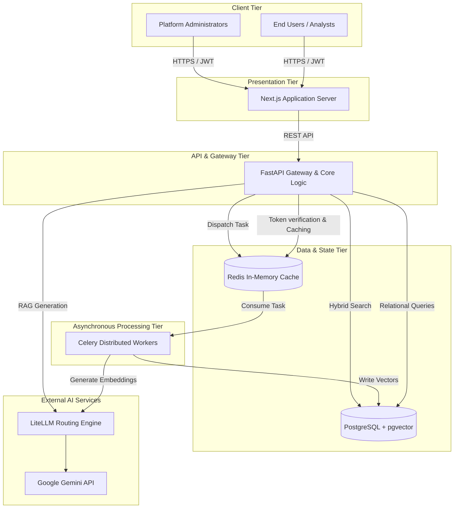

# Chapter 1: The Business Problem

## 1.1 Introduction
In the era of Generative AI, enterprises face a paradox: they possess petabytes of valuable unstructured data (e.g., proprietary legal contracts, internal wikis, financial reports), but exposing this data to public Large Language Models (LLMs) like OpenAI's ChatGPT presents an unacceptable security and compliance risk. Conversely, training a massive, proprietary foundational model from scratch costs millions of dollars in compute (GPU clusters) and requires highly specialized machine learning engineers. 

## 1.2 The Solution: Retrieval-Augmented Generation (RAG)
**Athenis** was engineered specifically to solve this enterprise dilemma. It implements a self-hosted, scalable **Retrieval-Augmented Generation (RAG)** architecture. 

Instead of embedding facts directly into a model's weights through training, Athenis acts as an intelligent intermediary. When an enterprise user asks a question, the platform:
1. Intercepts the query.
2. Securely searches a proprietary, self-hosted database for highly relevant internal documents.
3. Injects those exact documents directly into the prompt context.
4. Forwards this context-rich prompt to an LLM to generate a precise, halluciation-free answer.

> **Engineering Insight**
> By strictly separating the *retrieval* of facts from the *generation* of text, Athenis guarantees that the AI cannot hallucinate answers outside of the provided context. Furthermore, because the database is self-hosted, row-level security and Role-Based Access Control (RBAC) can be rigidly enforced before the LLM ever sees the data.

## 1.3 Preventing Vendor Lock-in
A secondary, but equally critical, business problem is **vendor lock-in**. The landscape of AI providers is volatile; a model that is state-of-the-art today may be obsolete or prohibitively expensive tomorrow. 

To mitigate this, Athenis integrates **LiteLLM**, a dynamic routing abstraction layer. This allows the enterprise to swap between Google Gemini, Anthropic Claude, OpenAI, or even locally hosted open-source models (via Ollama) by simply changing an environment variable, requiring zero code changes to the core application.

---

# Chapter 2: High Level Architecture

## 2.1 Architectural Topology
Athenis departs from traditional monolithic design patterns, opting instead for a highly decoupled, microservices-inspired architecture. This topology strictly separates the presentation layer, the synchronous API gateway, and the asynchronous background compute engines.

### 2.1.1 The Presentation Tier (Next.js)
The frontend is a React-based application built on the **Next.js** framework. Next.js was chosen specifically for its App Router paradigm, which allows for aggressive server-side rendering (SSR) and seamless API route handling. The interface is styled using Tailwind CSS for rapid, utility-first design.

### 2.1.2 The Synchronous Gateway (FastAPI)
The core of Athenis is the **FastAPI** Python backend. FastAPI was selected over Django or Flask due to its native integration with Python's `asyncio` event loop. Because the platform spends a significant amount of time waiting for network I/O (e.g., waiting for database queries or LLM responses), an asynchronous loop allows a single Python process to handle thousands of concurrent connections without blocking.

### 2.1.3 The Asynchronous Processing Engine (Celery)
While FastAPI handles lightweight, synchronous HTTP requests, processing a 500-page PDF document is massively CPU-bound. Attempting to parse, chunk, and mathematically embed this document inside the FastAPI event loop would instantly crash the server.

To solve this, Athenis employs **Celery**. Celery is a distributed task queue that runs in entirely separate Docker containers. It allows FastAPI to offload heavy compute tasks asynchronously.

### 2.1.4 State & Persistence (PostgreSQL & Redis)
- **PostgreSQL**: Serving as the primary relational datastore, PostgreSQL is extended with the **`pgvector`** extension. This allows Athenis to store both traditional relational data (users, document metadata) and high-dimensional vector embeddings in the exact same ACID-compliant database.
- **Redis**: An in-memory data structure store that operates with sub-millisecond latency. Athenis utilizes Redis for two entirely separate purposes:
  1. As the message broker for Celery (passing tasks from FastAPI to the workers).
  2. As a high-speed caching layer for JWT validation and API rate limiting (via `slowapi`).

## 2.2 System Diagram

*Figure 2.1: The System Dashboard visualizing the underlying telemetry of the architecture, capturing real-time metrics across the decoupled tiers.*

> **Production Recommendation**
> In a production deployment, the Next.js container should be the only service exposed to the public internet (via an Ingress controller or Load Balancer). FastAPI, Celery, PostgreSQL, and Redis must remain strictly isolated within a private Virtual Private Cloud (VPC) subnet to prevent unauthorized external access.

## 2.3 Comprehensive System Topology

