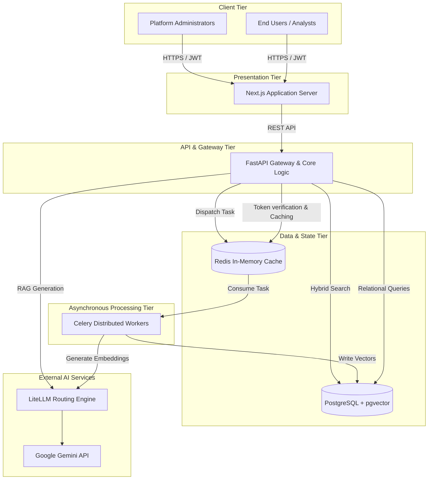

# 1. Introduction & Strategic Vision

## 1.1 Purpose of this Handbook
Welcome to the Athenis AI Platform. If you are reading this, you are likely a new senior engineer, architect, or DevOps specialist joining the team. This handbook is your definitive guide to understanding the platform. It is not a code reference manual; rather, it is a comprehensive journey through the architectural decisions, data flows, failure states, and runtime behaviors that define Athenis. By the time you finish this book, you will possess a complete mental model of the entire system and be capable of modifying, scaling, and debugging it with absolute confidence.

## 1.2 The Business Problem & Motivation
In modern enterprise environments, organizations possess vast amounts of unstructured data (PDFs, internal wikis, documentation) but struggle to extract actionable insights securely. Public LLMs (like OpenAI's ChatGPT) pose severe data privacy risks, and building custom models is prohibitively expensive.

**Athenis** was engineered to solve this exact problem by implementing a self-hosted, multi-tenant **Retrieval-Augmented Generation (RAG)** architecture. Instead of retraining models, Athenis dynamically fetches secure, proprietary context from a high-performance vector database and injects it into the prompt. Furthermore, to avoid vendor lock-in, the platform utilizes an abstraction layer that routes requests to any major LLM provider (Gemini, Claude, GPT-4) based on availability and cost.

## 1.3 Engineering Tradeoffs & Core Decisions
To achieve enterprise scalability, several critical architectural choices were made:

| Technology | The Problem it Solves | Why it was Chosen over Alternatives |
|------------|-----------------------|-------------------------------------|
| **FastAPI** | Backend API serving | Chosen for native `asyncio` support and extreme throughput compared to Django/Flask. |
| **Next.js** | Frontend presentation | Chosen for Server-Side Rendering (SSR) and seamless SEO optimization. |
| **PostgreSQL** | Data persistence | Selected because the `pgvector` extension allows us to store relational data and vector embeddings in the exact same ACID-compliant database. |
| **Redis** | State management | Chosen for its sub-millisecond latency. It acts as both a caching layer and the Celery message broker. |
| **Celery** | Asynchronous jobs | Essential for offloading heavy PDF parsing and embedding extraction so the main API event loop is never blocked. |
| **LiteLLM** | AI Routing | Chosen to prevent vendor lock-in. It standardizes API calls across 100+ LLMs. |

---

# 2. The 10,000-Foot View: Enterprise Topology

## 2.1 Architectural Overview
Athenis operates as a decoupled, microservices-inspired platform. The architecture is intentionally separated into a synchronous, user-facing presentation layer and an asynchronous, heavy-compute processing layer.

## 2.2 System Diagram

## 2.3 The Request Lifecycle (High Level)
When a user submits a query to the chat interface:
1. The **Next.js** frontend captures the input and attaches the user's JWT.
2. The request hits **FastAPI**, which validates the JWT via **Redis** to ensure the token hasn't been revoked and the user hasn't exceeded rate limits.
3. FastAPI executes a **Hybrid Search** against **PostgreSQL**, combining semantic vector similarity with exact keyword matching.
4. The retrieved context is bundled with the original prompt.
5. FastAPI forwards the payload to **LiteLLM**, which dynamically routes it to the designated provider (e.g., Gemini).
6. The generated response is streamed back through FastAPI to the Next.js frontend, rendering in real-time for the user.

## 2.4 Important Notes & Best Practices
- **Network Isolation:** In production, only the Next.js server is exposed to the public internet via an Ingress controller. FastAPI, PostgreSQL, and Redis remain completely isolated within the private VPC.
- **Stateless APIs:** The FastAPI layer is entirely stateless. Any instance can be killed or spun up instantly because all state is offloaded to Redis and PostgreSQL.

## 2.5 Troubleshooting the Core Topology
**Symptom:** The frontend loads, but all API requests instantly fail with HTTP 502 Bad Gateway.
**Root Cause Diagnosis:** The Nginx reverse proxy (or Kubernetes Ingress) cannot reach the FastAPI service. 
**Verification:** SSH into the cluster and run `curl http://backend:8000/health`. If it times out, the backend container has crashed or the Docker bridge network is misconfigured.

---
