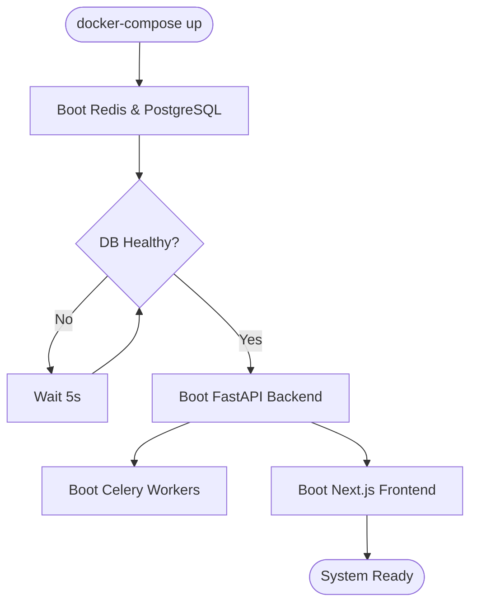
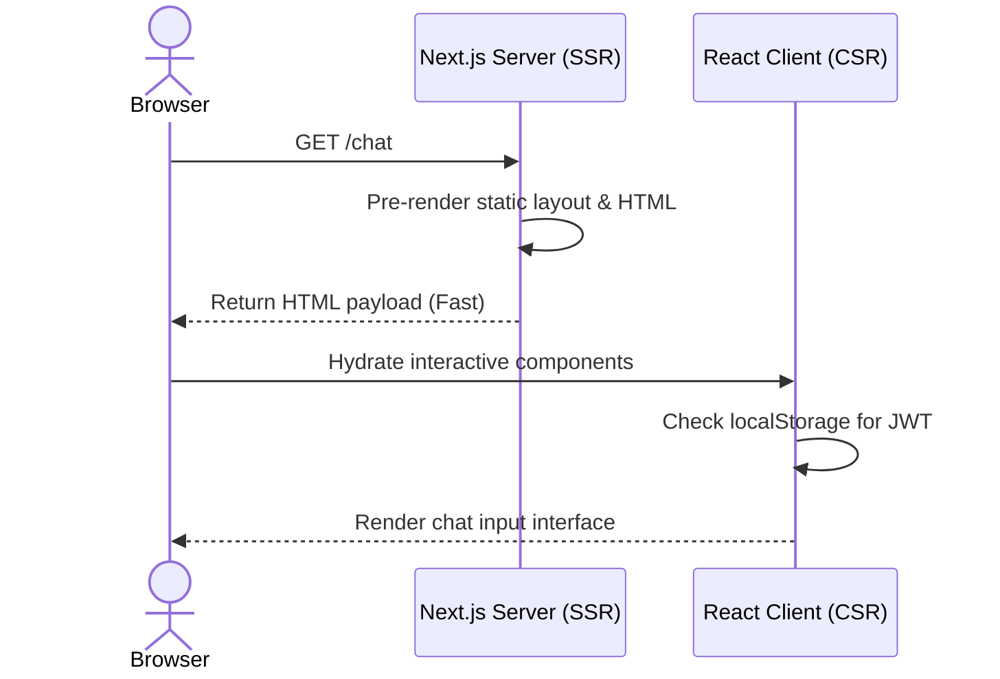

# Chapter 3: Application Startup

## 3.1 The Boot Sequence
When a DevOps engineer or deployment pipeline runs `docker compose up`, Athenis does not boot simultaneously. The services must start in a rigid, heavily orchestrated sequence to prevent catastrophic initialization failures.

1. **The State Layer Boot**: PostgreSQL and Redis containers boot first. They are the foundational state engines of the architecture.
2. **The Database Migration Check**: The FastAPI backend container initializes, but it cannot immediately accept traffic. It halts its event loop to verify the integrity of the PostgreSQL schema.
3. **The API Gateway Boot**: Once the database connection pool is established and verified, FastAPI mounts its CORS middleware, configures its OpenTelemetry tracing hooks, and registers the REST API routers. It is now ready to receive connections.
4. **The Worker Boot**: The Celery workers boot and immediately connect to Redis, signaling that they are ready to consume asynchronous jobs.
5. **The Presentation Boot**: Finally, the Next.js frontend container boots, ready to serve HTML to the end-user browser.

> **Common Pitfall**
> Attempting to bypass the Docker Compose `depends_on` directives (e.g., trying to boot FastAPI before PostgreSQL) will instantly crash the backend. FastAPI requires a valid database connection string during the instantiation of the SQLAlchemy session factory.

## 3.2 FastAPI Middleware & Observability Initialization
If you trace the execution flow inside the backend startup lifecycle, you will notice a heavily decorated middleware stack. 

Why are middlewares critical? A middleware intercepts an HTTP request *before* it reaches the specific API router. Athenis utilizes middleware for two vital functions:
- **Rate Limiting (`slowapi`)**: To prevent malicious actors from performing Denial of Service (DoS) attacks or exhausting the enterprise's LLM budget, every request IP is logged into Redis. If an IP exceeds the configured limits (e.g., 50 requests per minute), the middleware forcefully drops the connection with an HTTP 429 error.
- **Correlation IDs**: For distributed tracing, a unique `X-Request-ID` is assigned to every single HTTP packet as soon as it enters the FastAPI gateway. This ID is subsequently passed down into the Celery workers and PostgreSQL query logs, allowing site reliability engineers (SREs) to trace a user's action across the entire decoupled topology.

---

# Chapter 4: Frontend Initialization

## 4.1 The Next.js Paradigm
When a user opens `http://localhost:3000` in their browser, they are greeted by the Athenis presentation layer. Athenis relies on **Next.js**, specifically utilizing the modern `App Router` architecture.

### 4.1.1 Server-Side Rendering (SSR) vs. Client-Side Rendering (CSR)
Next.js allows components to be rendered either on the server (node.js) or locally in the user's browser. 

Athenis strategically divides these approaches:
- **Server Components**: The layout wrappers, heavy static assets, and initial HTML frames are pre-rendered on the server. This guarantees that the user sees a visually complete page almost instantly, drastically improving perceived performance.
- **Client Components**: Interactive elements, such as the Chat input box and the JWT token managers, are decorated with the `"use client"` directive. These components must execute in the browser because they require access to the DOM (Document Object Model) and local browser storage mechanisms (like `localStorage`).

## 4.2 Handling Global State
In a traditional React application, a global state management library like Redux might be used. However, Athenis avoids this complexity by relying on lightweight React Hooks (like `useState` and `useEffect`) combined with secure token storage. 

When the frontend initializes, a `useEffect` hook immediately checks the browser's `localStorage` for a valid JWT. If no token is found, the user is forcefully redirected to the unified login portal, completely locking down the application.

> **Security Note**
> `localStorage` is vulnerable to Cross-Site Scripting (XSS) attacks. If an attacker manages to execute malicious JavaScript on the Athenis domain, they could scrape the JWT. In enterprise deployments requiring maximum security, this architecture can be hardened by refactoring the JWT delivery mechanism to use `httpOnly` secure cookies.
