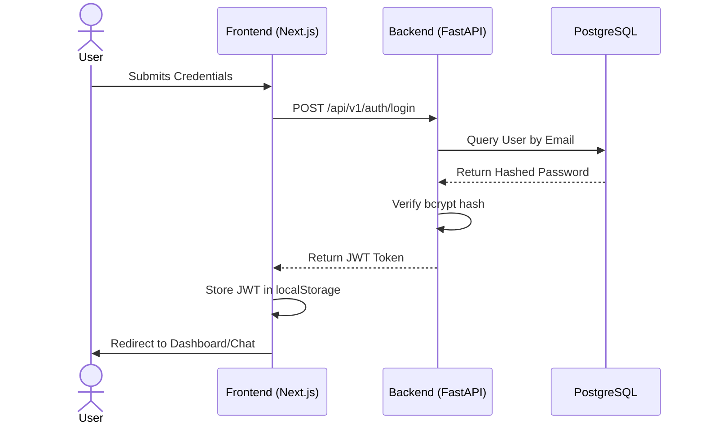
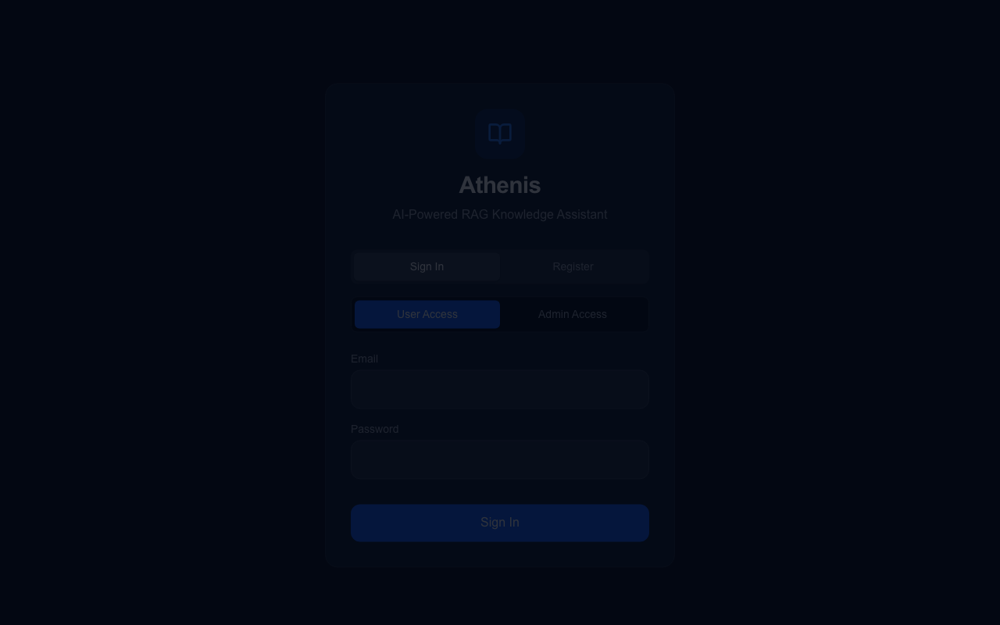

# 3. The User Journey: Authentication & Access Control

## 3.1 Introduction to the Authentication Flow
When a user opens Athenis in their browser, they are greeted by a unified login portal. Before any data can be queried or uploaded, the user must prove their identity. The authentication architecture relies entirely on stateless **JSON Web Tokens (JWT)**. 

Why stateless? By issuing a cryptographically signed token that lives in the client’s browser (`localStorage`), the FastAPI backend does not need to store thousands of active session IDs in a database. This decision dramatically reduces database I/O and allows the backend to scale horizontally without sticky sessions.

## 3.2 The Login Sequence
1. The user inputs their email and password on the Next.js login screen.
2. Next.js wraps this into an `OAuth2PasswordRequestForm` payload and dispatches a `POST` request to `/api/v1/auth/login`.
3. The FastAPI router intercepts this request. It immediately queries the PostgreSQL `users` table to fetch the hashed password.
4. Using the `bcrypt` algorithm, FastAPI verifies the password. If it matches, the `AuthService` generates a JWT containing the user's `sub` (username) and their `role` (Admin vs User).
5. The JWT is returned to Next.js, which stores it securely and redirects the user.

## 3.3 Role-Based Access Control (RBAC) Enforcement
Athenis defines two rigid roles:
- **Users**: Bound exclusively to the `/chat` interface. They can query the cognitive engine but cannot upload documents or view system metrics.
- **Administrators**: Granted elevated privileges. They bypass the chat and are redirected to the Unified Dashboard (`/dashboard`) where they manage the Knowledge Base.

### 3.3.1 How Roles are Enforced Internally
When an Administrator attempts to navigate to the Document Management page, Next.js does not simply trust the local state. Instead, it fires a secondary validation request to `/api/v1/auth/me`. 

The FastAPI backend decodes the JWT using the `SECRET_KEY`. If the signature is valid, it inspects the embedded role. If a normal user attempts to force their way into the admin panel, FastAPI immediately rejects the request with a `403 Forbidden` HTTP status, and Next.js forces a hard redirect back to the login screen.

## 3.4 Visualizing the Interface

*Figure 3.1: The Athenis Login Portal. This screen exists to securely funnel users and administrators into their respective isolated environments.*

## 3.5 Common Mistakes & Troubleshooting
- **Mistake**: Changing the `SECRET_KEY` in the `.env` file after users have already logged in. 
  - *Result*: All currently issued JWTs will immediately become invalid. Users will see a `401 Unauthorized` error when they try to send a message. 
  - *Solution*: Always force users to log out and log back in if the signing key is rotated.
- **Troubleshooting Role Bounces**: If an Admin is repeatedly bounced back to the User chat, verify that the `is_admin` boolean flag in the PostgreSQL `users` table is set to `true`. This often occurs during manual database migrations if the flag defaults to `false`.

---
