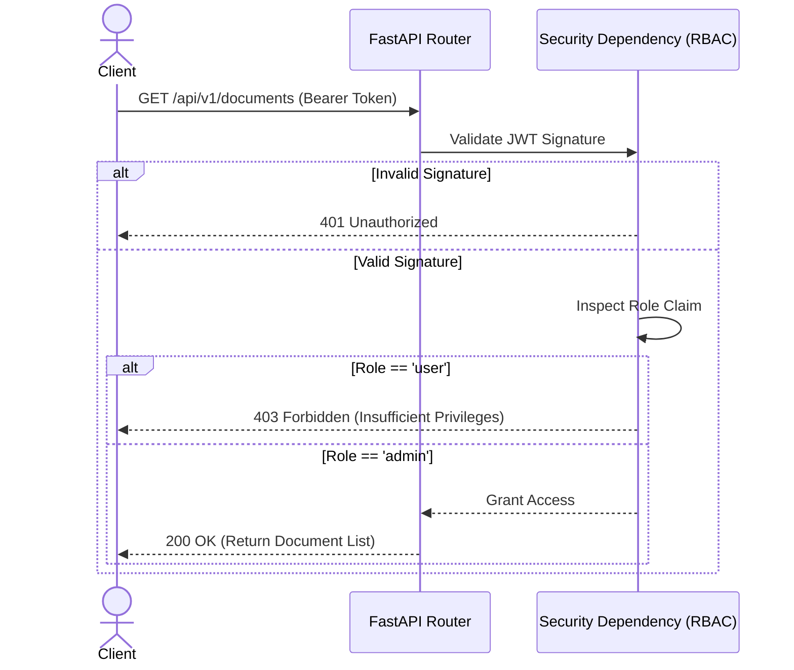

# Chapter 5: Backend Initialization & Configuration

## 5.1 The FastAPI Core
Athenis utilizes FastAPI as its primary HTTP gateway. The choice of FastAPI over older synchronous frameworks is not merely a preference; it is a strict architectural requirement for high-throughput AI applications.

When a large language model generates a response, it streams that response over the network. If the backend gateway was synchronous, the thread handling that request would block completely until the AI finished responding. By utilizing Python's `async/await` syntax, FastAPI can suspend the execution of the thread while waiting for network I/O, allowing a single process to handle hundreds of concurrent LLM streams.

## 5.2 Environmental Configuration
Before the backend can accept any traffic, it must establish its operating parameters. Athenis strictly adheres to the Twelve-Factor App methodology by externalizing all configuration into environment variables.

During startup, the application parses variables such as:
- `GEMINI_API_KEY`: The authentication token for the AI model.
- `POSTGRES_USER` & `POSTGRES_PASSWORD`: Database credentials.
- `REDIS_URL`: The broker address for Celery.
- `SECRET_KEY`: The cryptographic signing key for JWTs.

> **Debugging Tip**
> If the backend crashes instantly with a `ValidationError`, it means Pydantic (FastAPI's underlying validation library) detected a missing or malformed environment variable. Always verify your `.env` file matches the required schema defined in the configuration models.

---

# Chapter 6: Authentication & Authorization Internals

## 6.1 The JWT Lifecycle
Authentication within Athenis is entirely stateless. The system relies on JSON Web Tokens (JWT) signed using the HMAC SHA-256 algorithm.

### 6.1.1 Token Generation
When a user successfully authenticates (by providing a valid email and bcrypt-hashed password), the backend constructs a JWT payload. This payload contains:
- `sub`: The unique identifier (email) of the user.
- `role`: A string designating the user's permission level (`admin` or `user`).
- `exp`: An expiration timestamp, typically set to 24 hours in the future.

This payload is signed using the server's `SECRET_KEY`. Because the signature is cryptographically secure, the backend does not need to store the token in the database to verify its authenticity later.

## 6.2 Role-Based Access Control (RBAC)
In enterprise software, authentication (proving who you are) is only half the battle. **Authorization** (proving what you are allowed to do) is equally critical.

Athenis implements RBAC through FastAPI Dependency Injection. Every secured API endpoint is decorated with a dependency (e.g., `Depends(verify_admin)`).

### 6.2.1 The Execution Flow of a Secured Request
1. The Next.js frontend attaches the JWT to the `Authorization` header as a Bearer token.
2. FastAPI receives the request and extracts the header.
3. The cryptographic signature is verified against the server's `SECRET_KEY`. If the signature is invalid (meaning the token was forged or tampered with), the server instantly rejects the request with HTTP 401.
4. If valid, the payload is decoded, and the `role` attribute is inspected.
5. If the endpoint requires Admin privileges (such as `/api/v1/documents/upload`) and the token role is `user`, the dependency throws an HTTP 403 Forbidden exception, halting execution before the core logic is ever touched.

> **Security Note**
> Because JWTs are stateless, they cannot be easily revoked before they expire. If an employee is terminated, changing their password will not invalidate their existing JWT. For true enterprise security, Athenis should be extended to implement a "token blacklist" stored in Redis, allowing administrators to manually revoke specific tokens.
