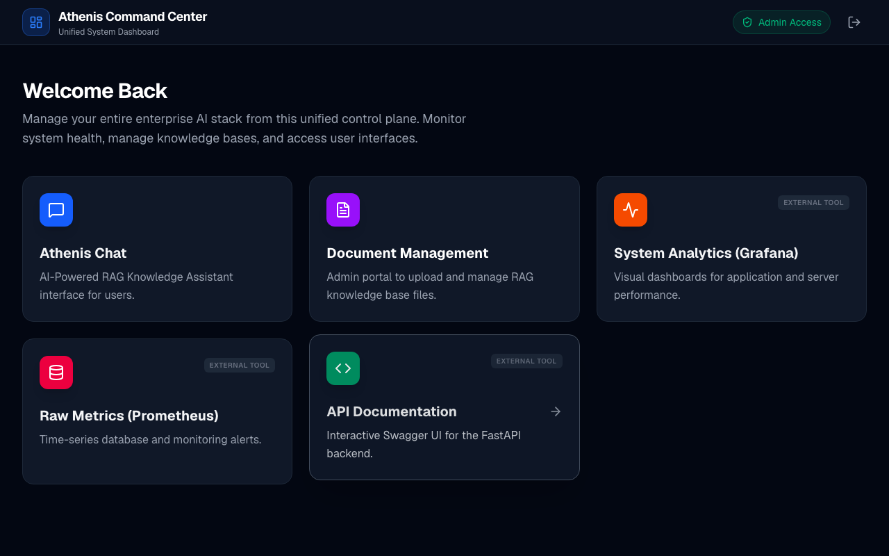

# 4. The Ingestion Pipeline: Turning Documents into Knowledge

## 4.1 Introduction & Purpose
For an LLM to answer questions about proprietary data, it first needs access to that data in a machine-readable, mathematically searchable format. This process is called "Ingestion." Athenis implements a highly robust, asynchronous pipeline to process PDFs and text documents uploaded by Administrators.

## 4.2 Architectural Tradeoffs
Why not process documents directly in the FastAPI endpoint?
If an Admin uploads a 500-page PDF, processing it (parsing text, splitting it, calling an embedding model thousands of times) might take 5 minutes. If FastAPI handled this synchronously, the HTTP request would block the worker thread, causing the connection to time out and rendering the API unresponsive to other users.

To solve this, Athenis uses **Celery**. Celery acts as an asynchronous task queue. The FastAPI endpoint simply saves the file to disk and says "I'm done." It then throws a message into a Redis queue. A separate Celery worker process constantly monitors Redis, picks up the task, and does the heavy lifting in the background.

## 4.3 The Step-by-Step Execution Lifecycle
1. **Upload Request**: An Administrator navigates to the Document Management dashboard and uploads a file.
2. **Streaming to Disk**: FastAPI receives the file and streams it directly to a secure volume to avoid exhausting RAM.
3. **Database Registration**: A record is inserted into the `documents` table with a status of `PROCESSING`.
4. **Message Broker Hand-off**: FastAPI enqueues a `process_document_task` into Redis.
5. **Text Extraction**: The Celery worker picks up the task, opens the file, and extracts raw text.
6. **Chunking**: The raw text is split into smaller overlapping "chunks" (e.g., 1000 characters with a 200-character overlap). This ensures that sentences are not broken abruptly and context is preserved.
7. **Embedding Generation**: The worker sends these chunks to the LLM Embedding API (e.g., `text-embedding-3-small`). The API returns a 768-dimensional vector representation of the text.
8. **Vector Storage**: The chunks and their corresponding vectors are saved into the `document_chunks` PostgreSQL table utilizing the `pgvector` extension.
9. **Completion**: The document status is updated to `READY`.

```mermaid
flowchart TD
    A[Admin] -->|Upload File| API[FastAPI /upload]
    API -->|1. Save File| Disk[(Local Volume)]
    API -->|2. Insert 'PROCESSING'| DB[(PostgreSQL)]
    API -->|3. Enqueue Task| Redis[(Redis Broker)]
    API -->> A: Returns 202 Accepted
    
    Redis -->|4. Consume Task| Worker[Celery Worker]
    Worker -->|5. Read File| Disk
    Worker -->|6. Chunk Text| Worker
    Worker -->|7. Generate Embeddings| EmbedAPI[Embedding Model]
    Worker -->|8. Store Vectors & BM25| DB
    Worker -->|9. Update to 'READY'| DB
```

## 4.4 Data Flow & PostgreSQL pgvector Integration
Once the data reaches PostgreSQL, it is stored in the `document_chunks` table. This table contains:
- `text`: The raw string of the chunk.
- `embedding`: A mathematical array of floats (`VECTOR(768)`).
- `fts_vector`: A parsed TSVECTOR representation used for Full-Text Search (keyword matching).

By maintaining all three formats in a single row, Athenis avoids the architectural complexity of running two separate databases (e.g., Pinecone + PostgreSQL). This drastically reduces infrastructure costs and prevents data synchronization nightmares.

## 4.5 Visualizing the Interface


*Figure 4.1: The Knowledge Base Dashboard. This screen allows Administrators to upload documents and track the real-time processing status of the asynchronous Celery pipeline.*

## 4.6 Troubleshooting the Ingestion Pipeline
- **Symptom:** Documents remain stuck in the `PROCESSING` state indefinitely.
  - *Root Cause:* The Celery worker process is either dead or disconnected from Redis.
  - *Diagnosis:* Run `docker compose -f docker-compose.prod.yml logs -f celery_worker`. If you see "Cannot connect to Redis," verify the network configuration. If the logs are completely empty, the container has likely crashed or run out of memory.
- **Symptom:** Out Of Memory (OOM) Killed.
  - *Root Cause:* Processing excessively large PDFs (1GB+) without chunking the byte stream.
  - *Solution:* Ensure the Docker container is allocated at least 4GB of RAM, and verify the `CHUNK_SIZE` parameter in `document_tasks.py` is respected.

---
