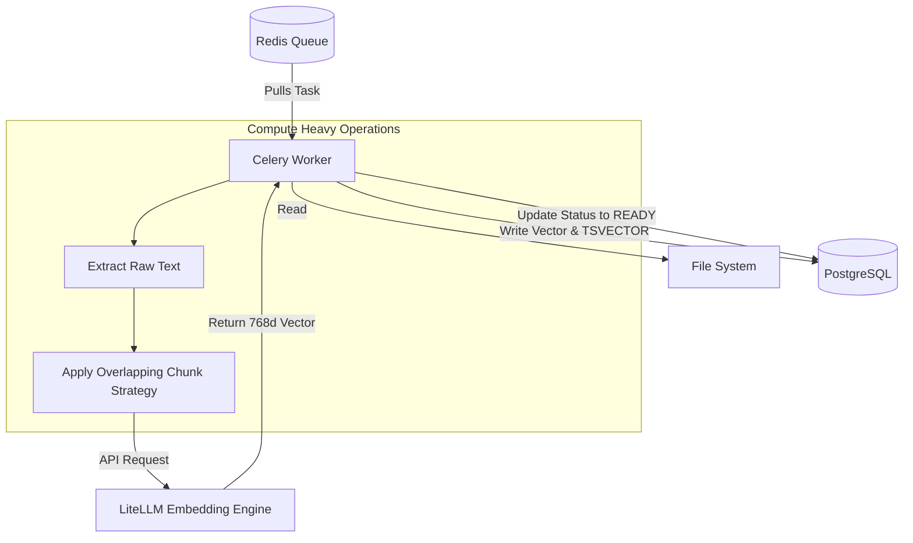

# Chapter 7: The Document Upload Lifecycle

## 7.1 Introduction
The core value proposition of Athenis is its ability to ingest proprietary enterprise documents and make them searchable via AI. This process begins when an Administrator navigates to the Document Management dashboard.

## 7.2 Handling Large Payloads
When an admin uploads a 50MB PDF document, the backend must handle this payload delicately. Loading a 50MB file directly into RAM via the FastAPI endpoint is highly inefficient, especially under heavy load (e.g., 20 admins uploading files simultaneously). 

Instead, FastAPI utilizes **Multipart form streaming**. The file is intercepted and streamed directly to a persistent local volume (`data/uploads`) in chunks. Once the file is safely written to disk, FastAPI records its location in the PostgreSQL `documents` table, marking its status as `PROCESSING`.

## 7.3 Disconnecting the Event Loop
As soon as the database record is created, FastAPI's job is completely finished. It does not wait for the document to be parsed or vectorized. It simply packages the document's ID and file path into a JSON payload and dispatches it to a Redis queue. 

FastAPI then immediately returns an HTTP 202 Accepted response to the frontend, freeing up the network socket to handle other users.

> **Engineering Insight**
> This decoupling pattern is the cornerstone of scalable architecture. By separating the fast network ingestion from the slow, CPU-bound processing, Athenis ensures that the API gateway never times out or drops user connections, even when the system is under extreme computational stress.

---

# Chapter 8: Background Processing & Embedding Generation

## 8.1 The Celery Worker Lifecycle
While the FastAPI gateway handles web traffic, entirely separate Python processes—known as **Celery Workers**—run in the background. These workers constantly poll the Redis queue.

When the `process_document_task` appears in the queue, a worker claims it. 

### 8.1.1 Stage 1: Text Extraction & Chunking
The worker opens the PDF from the disk volume. Using text extraction libraries, it rips the raw strings from the document. However, an entire document cannot be passed to an LLM at once; it would exceed the model's token limits and dilute the context.

To solve this, the text is sliced into smaller overlapping "chunks." 
- **Chunk Size**: Approximately 1,000 characters.
- **Overlap**: Approximately 200 characters.
The overlap ensures that if a crucial sentence spans across a chunk boundary, the context is not lost or broken in half.

### 8.1.2 Stage 2: Vector Embeddings
Once the text is chunked, the worker makes a network request to the configured Embedding API (via LiteLLM). 

An embedding model takes a string of text and converts it into a high-dimensional mathematical array of floating-point numbers (a vector). In Athenis, these vectors have exactly 768 dimensions. These 768 numbers mathematically map the semantic *meaning* of the text, allowing the system to perform complex similarity searches later.

### 8.1.3 Stage 3: Database Insertion
The final step of the Celery worker is to write these chunks into the `document_chunks` table in PostgreSQL.
The row contains:
1. The raw text of the chunk.
2. The 768-dimensional vector (for semantic search).
3. A `TSVECTOR` representation of the text (for exact keyword matching).

Once all chunks are successfully inserted, the worker updates the parent document's status to `READY`, and the frontend dashboard reflects this completion visually to the administrator.

> **Performance Note**
> Embedding generation is extremely network-intensive. If your Celery worker is processing a large document, it may hit the rate limits of your LLM provider. Athenis implements automatic exponential backoff to handle HTTP 429 Too Many Requests errors gracefully.
