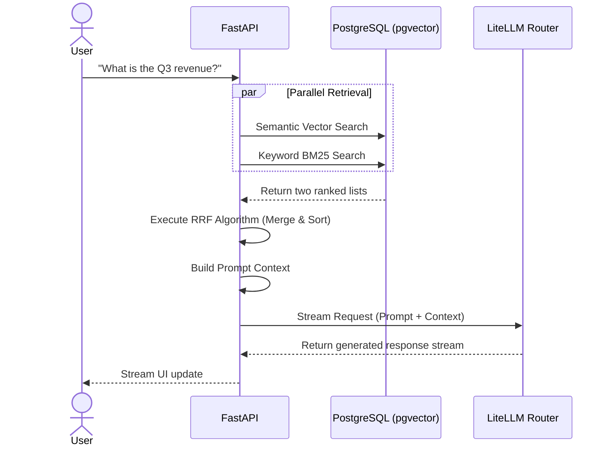
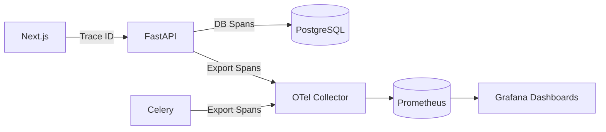

# 5. The Cognitive Engine: Hybrid RAG & Reciprocal Rank Fusion

## 5.1 Introduction & Purpose
Once documents are ingested and stored, the platform must retrieve them accurately when a user asks a question. Standard vector search (Cosine Similarity) is excellent at understanding the *meaning* of a sentence, but it often fails catastrophically at retrieving exact names, SKUs, or specialized terminology.

To solve this, Athenis implements a highly sophisticated **Hybrid Search Algorithm**.

## 5.2 The Retrieval Architecture (RRF)
When a user submits a query via the Chat Interface, the `RetrievalService` executes two parallel searches against PostgreSQL:

1. **Dense Vector Search**: The user's query is sent to the embedding model, converted into a vector, and compared against the `document_chunks` table using pgvector's `<=>` (cosine distance) operator.
2. **Sparse Keyword Search**: Simultaneously, the raw text query is converted into a `tsquery` and matched against the `fts_vector` column using PostgreSQL's native Full-Text Search (BM25).

If Athenis simply appended these two lists of results together, the AI would be overwhelmed by duplicate or irrelevant context. Instead, it uses **Reciprocal Rank Fusion (RRF)**.

### 5.2.1 How Reciprocal Rank Fusion Works
RRF is a mathematical technique to combine the rankings of multiple search strategies. For every chunk returned by either search, a score is calculated using the formula:
`RRF Score = 1.0 / (k + rank)`

By merging the lists based on this RRF score, Athenis guarantees that if a chunk is highly relevant in *both* semantic meaning and exact keyword matches, it rises to the absolute top of the context window.

## 5.3 The Generation Flow (LiteLLM Integration)
Once the top `N` highly-relevant chunks are retrieved, they are injected into the Prompt Template as `context`. 

Why `litellm`? Enterprise platforms cannot afford vendor lock-in. If OpenAI experiences an outage, or if Gemini releases a drastically cheaper model, engineering teams need to switch providers instantly. `litellm` abstracts the API differences between all major providers. 

The FastAPI backend passes the enriched prompt to `litellm`, which routes the request to the configured backend (currently Gemini).

## 5.4 Visualizing the Interface

*Figure 5.1: The Athenis Chat Interface. As the user types, the backend silently executes the RRF algorithm, pulling proprietary context from PostgreSQL before streaming the response back to the UI.*

## 5.5 Common Mistakes & Troubleshooting
- **Mistake**: Lowering the `k` constant in the RRF formula below 60.
  - *Result*: The fusion heavily penalizes items that only appear in one list, causing critical keyword matches (like serial numbers) to drop out of the context window entirely.
- **Troubleshooting Missing Answers**: If the AI responds "I don't know," check the retrieval threshold. If the vectors are too dissimilar, they might be dropped before hitting the LLM.

---

# 6. Infrastructure, Telemetry, and Deployment

## 6.1 Introduction & Purpose
A modern AI application is only as good as its deployment pipeline. Athenis uses a multi-stage Docker build process and a comprehensive OpenTelemetry observability stack to guarantee enterprise-grade uptime and visibility.

## 6.2 The Observability Stack
In an asynchronous, decoupled architecture, tracing a request is difficult. If a user asks a question, the request hits Next.js, then FastAPI, then the Embedding model, then PostgreSQL, then LiteLLM.

Athenis implements **OpenTelemetry (OTel)** to inject Trace IDs into every HTTP header and database span.
- **Prometheus**: Scrapes numerical metrics (e.g., API latency, error rates, LLM token consumption).
- **Grafana**: Visualizes these metrics in unified dashboards, allowing administrators to monitor costs and latency.

## 6.3 Deployment Architecture (Docker & K8s)
Athenis avoids monolithic deployments. 
- The **Frontend** uses Next.js `standalone` output mode to produce an ultra-lean Alpine Linux Docker image containing only runtime dependencies.
- The **Backend** utilizes Gunicorn alongside Uvicorn to spawn multiple asynchronous worker processes, maximizing CPU utilization on multi-core servers.

When deploying to Kubernetes, the system utilizes Horizontal Pod Autoscalers (HPA). The Celery workers can scale independently based on the size of the Redis message queue. If an administrator uploads 10,000 PDFs, the cluster will automatically spin up 50 Celery pods to churn through the backlog, then spin them down to save costs.

## 6.4 Visualizing Telemetry

*Figure 6.1: The System Dashboard. This is a crucial tool for administrators to track API Latency, Token Usage, and Active User counts in real-time, pulling directly from the underlying telemetry metrics.*

## 6.5 Best Practices for Production
- **Secrets Management**: Never commit `GEMINI_API_KEY` or `POSTGRES_PASSWORD`. Always use a secrets manager (like AWS Secrets Manager or HashiCorp Vault) and inject them as environment variables at runtime.
- **Scaling Redis**: Redis must be highly available. In production, utilize Redis Sentinel or a managed service like AWS ElastiCache. If Redis drops, the entire asynchronous ingestion pipeline instantly halts.

# 7. Summary & Conclusion
By breaking the system into a reactive presentation layer (Next.js), a stateless gateway (FastAPI), a stateful compute layer (Celery), and a unified data store (PostgreSQL + pgvector), Athenis achieves an extremely resilient architecture. You now possess the foundational knowledge of how data flows, how AI is routed, and how failures are mitigated. You are fully prepared to contribute, debug, and scale the Athenis platform.
