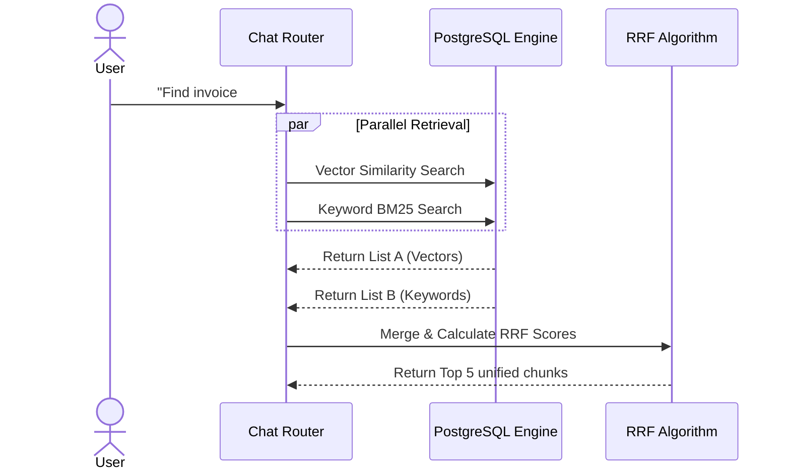

# Chapter 9: Storage & The Hybrid Cognitive Engine

## 9.1 Introduction to the Storage Layer
Athenis relies entirely on PostgreSQL for its primary persistence. While many RAG applications split their infrastructure between a relational database (like MySQL for users) and a vector database (like Pinecone for embeddings), Athenis consolidates this using the **`pgvector`** extension.

### 9.1.1 Why pgvector?
Running a dedicated vector database introduces extreme operational complexity. If a user deletes a document in MySQL, the system must perform an API call to Pinecone to delete the corresponding vectors. If that network call fails, the databases fall out of sync, and the AI will hallucinate answers from deleted data (a severe security violation).

By using `pgvector`, Athenis relies on standard PostgreSQL Foreign Key cascading. If an administrator deletes a document, PostgreSQL instantly and atomically deletes all associated vector chunks. Synchronization issues are mathematically impossible.

## 9.2 The Retrieval Architecture (Reciprocal Rank Fusion)
When a user asks a question (e.g., "What is the Q3 revenue for project Alpha?"), Athenis must search the database for relevant context before asking the LLM to generate an answer.

Athenis executes two entirely separate searches simultaneously:
1. **Semantic Vector Search (Cosine Distance)**: The user's question is converted into a vector. PostgreSQL uses the `<=>` operator to find chunks that are mathematically similar in meaning. This is excellent for conceptual questions, but terrible at finding exact SKUs or names.
2. **Keyword Search (BM25 / Full Text Search)**: The question is converted into a `tsquery`. PostgreSQL searches the `fts_vector` column for exact word matches.

### 9.2.2 Merging the Results
If the system just appended the two lists, the LLM would be confused by duplicate context. Instead, Athenis passes both lists through the **Reciprocal Rank Fusion (RRF)** algorithm.

The RRF algorithm assigns a score to every chunk based on its rank in the list:
`Score = 1.0 / (60 + rank)`

If a chunk appears in *both* lists (meaning it matches the semantic meaning AND the exact keywords), its scores are summed, propelling it to the absolute top of the final context window.

---

# Chapter 10: LLM Interaction & Streaming Responses

## 10.1 The LiteLLM Router
Once the top 5 most relevant chunks are retrieved via RRF, they are bundled together with the user's original question into a massive text block known as the "Prompt Template".

This prompt is forwarded to the LLM. However, Athenis does not use the OpenAI or Gemini SDK directly. It utilizes **LiteLLM**. This abstraction layer standardizes the API format. By simply changing the `GEMINI_API_KEY` to `OPENAI_API_KEY`, Athenis can instantly route all enterprise traffic to a different AI provider without rewriting a single line of core logic.

## 10.2 Server-Sent Events (SSE) Streaming
Generative AI models are slow. Generating a 500-word essay might take an LLM 10 seconds. If Athenis waited for the entire response to finish before sending it to the user, the UI would freeze, providing a terrible user experience.

Instead, Athenis implements **Streaming Responses** using Server-Sent Events (SSE). 
As the LLM generates individual tokens (words), LiteLLM streams them to FastAPI. FastAPI instantly yields these tokens across the open HTTP socket to Next.js. Next.js appends the tokens to the DOM in real-time. This creates the "typing" effect standard in modern AI interfaces and provides sub-second initial response latency.

> **Debugging Tip**
> If the chat interface appears to freeze and then suddenly dumps the entire paragraph of text all at once, check your Reverse Proxy (e.g., Nginx) configuration. Nginx often buffers HTTP responses by default. You must explicitly disable `proxy_buffering` for the `/api/v1/chat/completions` endpoint to allow the SSE stream to pass through unhindered.
