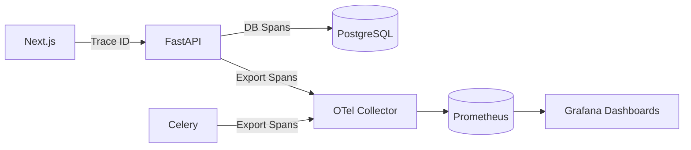

# Chapter 11: Monitoring & Observability Telemetry

## 11.1 The Observability Stack
In a decoupled, microservices architecture, a single user action (like asking a chat question) traverses the Next.js frontend, the FastAPI gateway, the PostgreSQL database, and the LiteLLM network boundary. If the request takes 5 seconds, how does a DevOps engineer know which component was slow?

Athenis implements **OpenTelemetry (OTel)** to solve this.

## 11.2 Trace Propagation
When a request enters FastAPI, the `CorrelationIdMiddleware` assigns it a unique UUID. This UUID is attached to every internal function call and database query. 

These traces are exported to a central telemetry collector (like Prometheus or Jaeger).
Additionally, Athenis tracks raw numerical metrics:
- **API Request Latency**: Histogram of response times.
- **LLM Token Usage**: Essential for billing. Every time a user chats, the token counts (prompt tokens + completion tokens) are calculated by `litellm` and exported.

## 11.3 Grafana Dashboards
These metrics are scraped by Prometheus and visualized in Grafana. The Unified Admin Dashboard in the Athenis frontend actually embeds or mimics these metrics to provide administrators with a real-time view of system health and AI token expenditure.

---

# Chapter 12: Deployment & Containerization Architecture

## 12.1 Docker Multi-Stage Builds
Athenis does not deploy raw source code to production servers. Every component is containerized using Docker.

The Next.js frontend utilizes a **Multi-Stage Build**. 
1. **Stage 1 (Builder)**: Pulls the heavy `node_modules`, compiles the TypeScript, and bundles the application.
2. **Stage 2 (Runner)**: Copies only the compiled `.next/standalone` bundle into a fresh, ultra-lean Alpine Linux image. 

> **Performance Note**
> By using multi-stage builds, the final Next.js production image size is reduced by over 80% (from ~1.5GB to ~150MB). This drastically speeds up Kubernetes pod initialization times during horizontal scaling events.

## 12.2 Kubernetes Deployment Strategy
In enterprise environments, `docker-compose` is insufficient for true high availability. Athenis includes native Kubernetes manifests (`k8s/`).

- **Deployments**: Define the desired state of the Next.js, FastAPI, and Celery worker pods.
- **Services**: Act as internal load balancers, ensuring that Next.js can always reach FastAPI even if individual backend pods are destroyed and recreated.
- **Horizontal Pod Autoscaling (HPA)**: The most critical aspect of the deployment. HPA monitors the CPU utilization of the Celery worker pods. If an administrator uploads an enormous batch of PDFs, the CPU spikes, and Kubernetes automatically provisions additional Celery pods to churn through the queue, terminating them once the work is complete.

---

# Chapter 13: Scaling Strategy & Disaster Recovery

## 13.1 Horizontal vs Vertical Scaling
Athenis is designed for aggressive **Horizontal Scaling**. Because FastAPI and Next.js are completely stateless (storing all JWTs and context in the client or Redis), you can run 100 instances of the backend behind a load balancer. 

However, PostgreSQL must be scaled **Vertically** (adding more RAM and CPU to the single master node) or scaled via Read Replicas, because relational databases are inherently stateful.

## 13.2 Disaster Recovery & Backups
If the Kubernetes cluster suffers a catastrophic failure, the stateless compute pods (Next.js, FastAPI, Celery) can be spun up in a new cluster in seconds.

The only critical assets are the persistent volumes:
1. **The PostgreSQL Database**: Contains user accounts and the mathematical vectors.
2. **The Uploads Volume**: Contains the raw PDF files.

> **Production Recommendation**
> In production (e.g., AWS), never run PostgreSQL inside a Kubernetes pod. Use a managed service like AWS RDS for PostgreSQL with the `pgvector` extension enabled. RDS provides automated daily snapshots and Point-In-Time-Recovery (PITR), guaranteeing that even in a worst-case scenario, data loss is mitigated to the exact minute before the crash.
